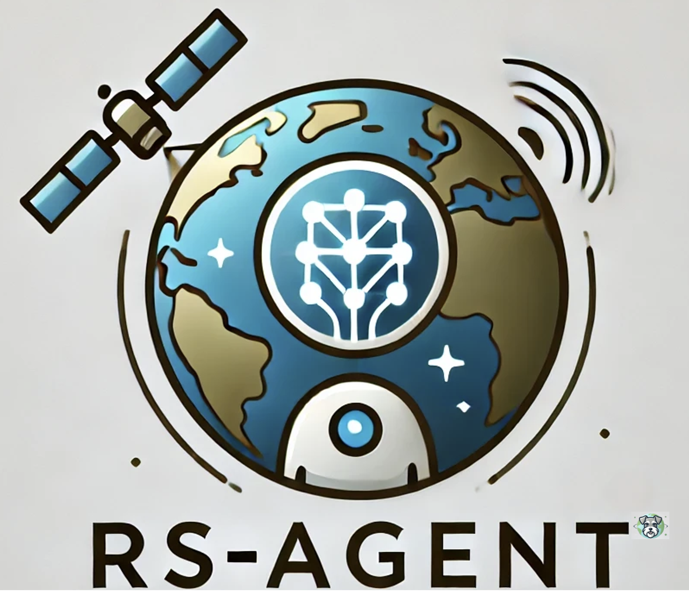
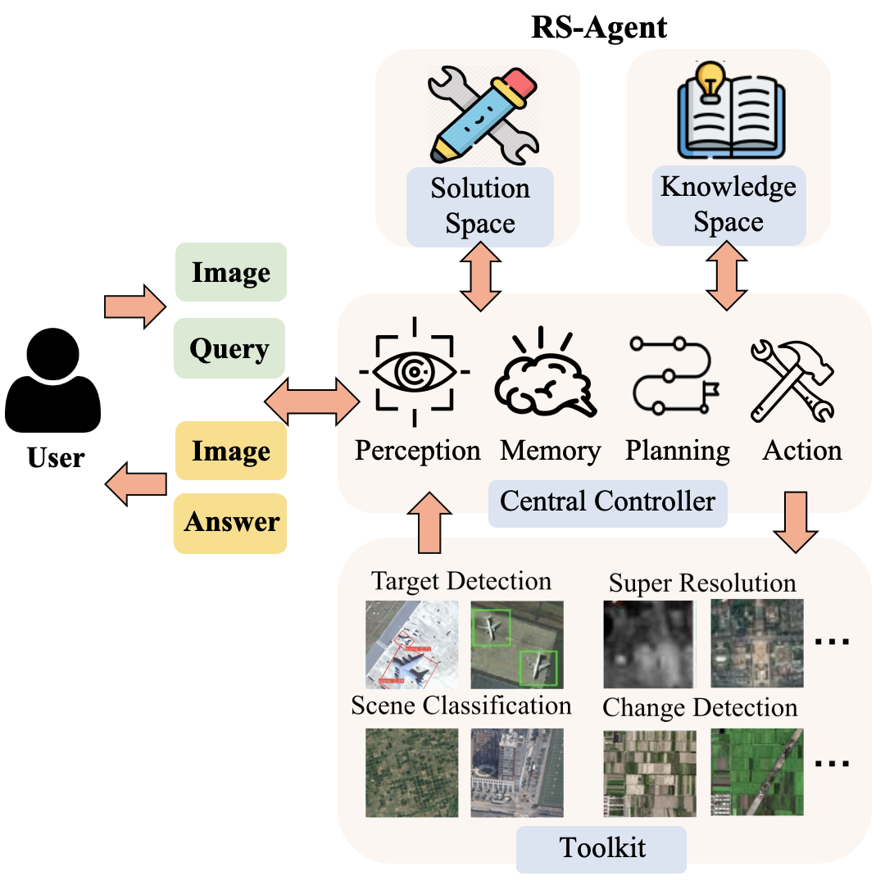
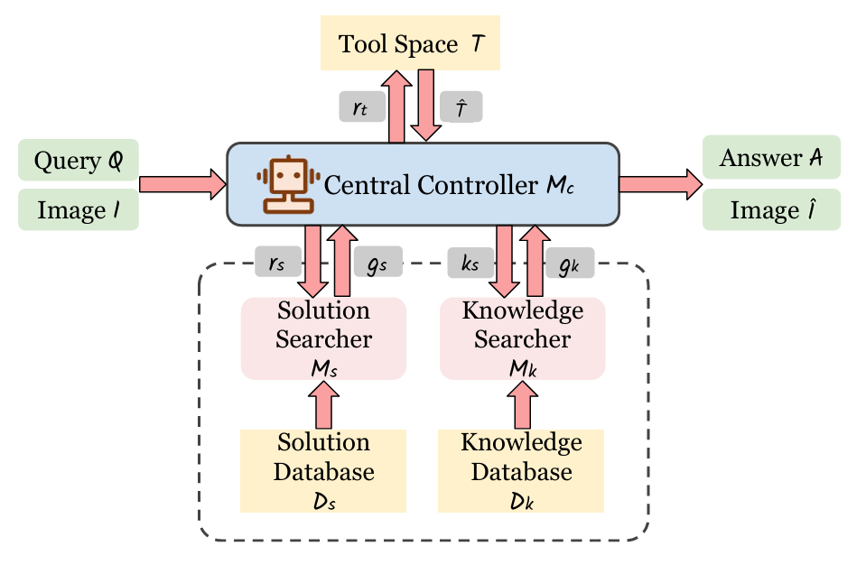
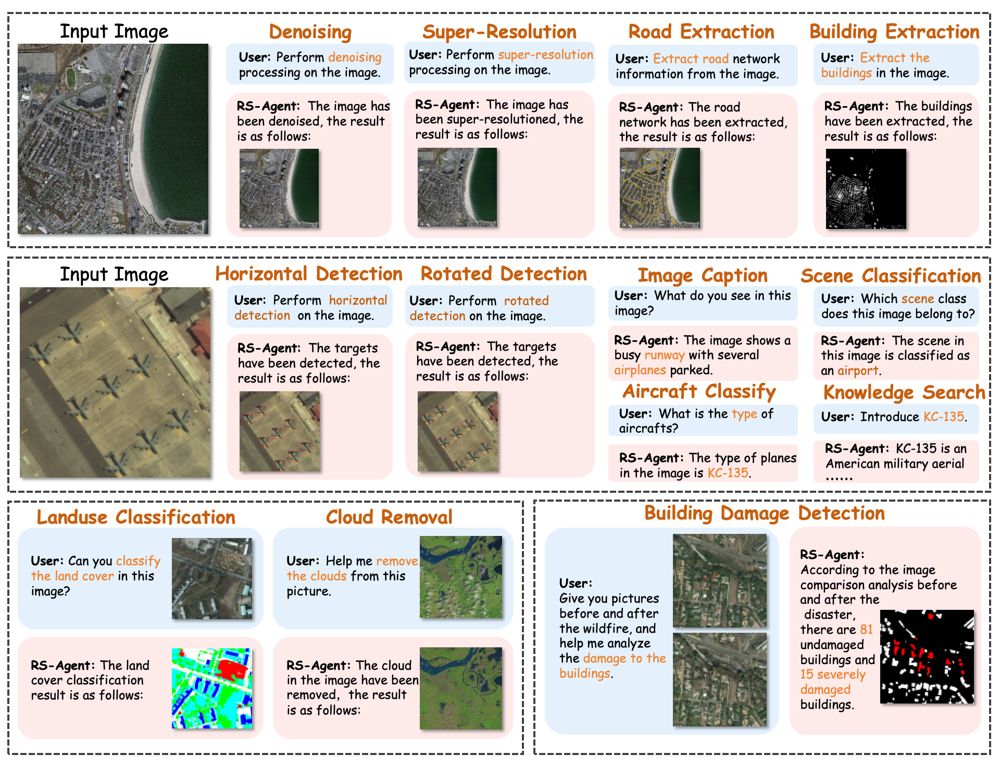

<div align="center">

<h1>RS-Agent: Automating Remote Sensing Tasks through Intelligent Agent</h1>

<p>
  <a href="https://xuwenjia.bupt.edu.cn/">Wenjia Xu</a><sup>*</sup>,
  <a href="#">Zijian Yu</a><sup>*</sup>,
  <a href="#">Boyang Mu</a>,
  <a href="#">Zhiwei Wei</a>,
  <a href="#">Yuanben Zhang</a>,
  <a href="#">Guangzuo Li</a> and
  <a href="https://teacher.bupt.edu.cn/pengmugen/zh_CN/index.htm">Mugen Peng</a>
  <br>
  <sup>*</sup> Equal Contribution
</p>

<p>
  <b>State Key Laboratory of Networking and Switching Technology, Beijing University of Posts and Telecommunications</b><br>
  <b>School of Geographic Sciences, Hunan Normal University</b><br>
  <b>Aerospace Information Research Institute, Chinese Academy of Sciences</b>
</p>

<p>
  <a href="https://intellisensing.github.io/RS-Agent/">Website</a> |
  <a href="#">Paper</a> |
  <a href="https://github.com/user-attachments/assets/ca5a3494-a6dd-43ae-835e-f222caf2dd9d">Video</a>
</p>



</div>

<p align="center">
  <a href="#introduction">Introduction</a> |
  <a href="#core-components">Core Components</a> |
  <a href="#supported-function">Supported Function</a> |
  <a href="#results">Results</a> |
  <a href="#getting-started">Getting Started</a> |
  <a href="#models">Models</a> |
  <a href="#toolkit">Toolkit</a>
</p>

https://github.com/user-attachments/assets/ca5a3494-a6dd-43ae-835e-f222caf2dd9d

## Introduction

Recent advancements in Large Language Models (LLMs) and Multi-modal Large Language Models (MLLMs) have led to impressive performance in remote sensing tasks. However, these models are limited to basic vision and language tasks and lack specialized expertise for complex remote sensing applications. To address these, we propose **RS-Agent**, an intelligent agent for remote sensing. RS-Agent is powered by an LLM as its "Central Controller," enabling it to understand and respond to various problems. It integrates high-performance remote sensing image processing tools, allowing multi-tool, multi-turn conversations for complex tasks. Additionally, RS-Agent utilizes a knowledge graph-enhanced Retrieval-Augmented Generation (RAG) framework to access domain-specific knowledge, ensuring accurate responses to expert-level queries. Experimental results show RS-Agent achieves over 95% task planning accuracy and demonstrates strong domain-specific knowledge retrieval, excelling across various tasks.

<p align="center">
  
</p>

## Core Components

1. **Central Controller**: Serves as the decision-making core of the agent. It interprets user queries, plans task execution, manages dialogue history, and synthesizes final responses.

2. **Toolkit**: A collection of state-of-the-art remote sensing tools for various applications. These tools are invoked based on the Central Controller's planning.

3. **Solution Space**: Stores predefined expert-level task solutions. It guides the Controller in selecting appropriate tools and execution strategies by retrieving relevant task-specific instructions via **Task-Aware Retrieval**.

4. **Knowledge Space**: Provides domain-specific information via a curated knowledge database. It supports expert-level reasoning by retrieving relevant content via **DualRAG**.

<p align="center">
  
</p>

## Supported Function

| Tool | Function | Example Input |
|:-------------------------------------:|:---------------------------------------------------:|:-----------------------------------------------------:|
| `cloud_removal` | Cloud removal from satellite images | Remove the clouds in this image. |
| `image_dehazing` | Haze removal from images | Dehaze this foggy image. |
| `super_resolution_2x` | Image super-resolution (2×) | Enhance the resolution of this image. |
| `denoising` | Image denoising | Remove noise from this image. |
| `caption` | Geo-specific VQA and captioning | What is in this remote sensing image? |
| `optical_detection` | Optical image target detection | Detect objects in this optical image. |
| `optical_plane_type` | Aircraft type recognition in optical images | What type of aircraft is in this image? |
| `scene` | Scene classification | What is the scene category of this image? |
| `sar_detection` | Target detection in SAR images | Find the objects in this SAR image. |
| `sar_plane_type` | Aircraft type recognition in SAR images | Identify the aircraft in this SAR image. |
| `knowledge_search` | Aircraft info retrieval via Knowledge Database | Who manufactures Boeing 747? |
| `building_damage_detection` | Building damage assessment | Which buildings are damaged? |
| `building_extraction` | Building extraction from images | Extract all buildings from the image. |
| `road_extraction` | Road extraction from images | Extract roads from the scene. |
| `horizontal_object_detection` | Horizontal bounding box detection | Detect objects using horizontal boxes. |
| `rotated_object_detection` | Rotated object detection | Detect objects using rotated boxes. |
| `semantic_segmentation` | Pixel-wise semantic segmentation | Segment the different regions in this image. |
| `land_use_classification` | Land use categorization | What are the land use types in this image? |

## Results

### Quantitative Results

To evaluate RS-Agent's adaptability, we evaluate its task planning accuracy when paired with different closed-source (GPT series) and open-source LLMs.

| Task | ChatGPT (3.5-turbo-1106) | ChatGPT (3.5-turbo) | ChatGPT (4o-mini) | LLaMa 3.1 (8B) | LLaMa 3.1 (70B) | Qwen2.5 (14B) | Qwen2.5 (32B) | Qwen2.5 (72B) | DeepSeek-r1 (70B) |
|-----------------------------|-------------------------|---------------------|-------------------|----------------|-----------------|----------------|----------------|----------------|-------------------|
| | (87.71t/s) | (65.03t/s) | (58.87t/s) | (100.78t/s) | (17.71t/s) | (69.61t/s) | (36.77t/s) | (16.24t/s) | (18.25t/s) |
| **Cloud Removal** | 95.00% | 95.00% | 100% | 100% | 100% | 100% | 95.00% | 100% | 100% |
| **Image Dehazing** | 30.00% | 95.00% | 100% | 100% | 100% | 100% | 100% | 100% | 75.00% |
| **Super Resolution** | 100% | 100% | 100% | 0.00% | 100% | 100% | 100% | 100% | 95.00% |
| **Denoising** | 90.00% | 100% | 100% | 100% | 100% | 100% | 100% | 100% | 90.00% |
| **Image Captioning** | 55.00% | 45.00% | 90.00% | 15.00% | 60.00% | 70.00% | 80.00% | 80.00% | 10.00% |
| **Object Detection** | 75.00% | 60.00% | 95.00% | 30.00% | 90.00% | 90.00% | 85.00% | 100% | 85.00% |
| **Optical Plane Classification** | 100% | 100% | 100% | 100% | 100% | 100% | 100% | 100% | 95.00% |
| **Scene Classification** | 20.00% | 90.00% | 100% | 80.00% | 90.00% | 90.00% | 100% | 100% | 50.00% |
| **SAR Detection** | 30.00% | 100% | 100% | 75.00% | 95.00% | 100% | 100% | 100% | 100% |
| **SAR Plane Classification** | 100% | 100% | 100% | 100% | 100% | 100% | 100% | 100% | 90.00% |
| **Knowledge Search** | 100% | 100% | 100% | 100% | 80.00% | 100% | 100% | 100% | 10.00% |
| **Building Damage Detection** | 100% | 100% | 100% | 100% | 100% | 95.00% | 100% | 100% | 100% |
| **Building Extraction** | 10.00% | 70.00% | 100% | 55.00% | 100% | 100% | 100% | 100% | 100% |
| **Road Extraction** | 15.00% | 55.00% | 100% | 65.00% | 100% | 100% | 100% | 100% | 100% |
| **Horizontal Detection** | 20.00% | 55.00% | 100% | 95.00% | 100% | 100% | 100% | 100% | 100% |
| **Rotated Detection** | 15.00% | 35.00% | 100% | 85.00% | 90.00% | 100% | 100% | 100% | 100% |
| **Semantic Segmentation** | 60.00% | 100% | 100% | 80.00% | 100% | 100% | 100% | 100% | 80.00% |
| **Land Use Classification** | 15.00% | 100% | 100% | 75.00% | 100% | 100% | 100% | 95.00% | 95.00% |
| **Average Accuracy** | 57.22% | 82.50% | 99.17% | 75.28% | 94.72% | 96.94% | 97.78% | 98.61% | 81.94% |

### Qualitative Results

<p align="center">
  
</p>

## Getting Started

### 1. Environment

```bash
conda activate gpt        # or your own env with langchain, faiss, etc.
git clone https://github.com/IntelliSensing/RS-Agent.git
cd RS-Agent
export PYTHONPATH=.
```

### 2. Configuration

```bash
cp .env.example .env
```

Edit `.env`:

```bash
OPENAI_API_KEY=your-key-here
OPENAI_API_BASE=https://api.openai.com/v1

# Embedding model: HuggingFace id or local path
EMBEDDING_MODEL=moka-ai/m3e-base
EMBEDDING_DEVICE=cpu
```

### 3. Build Solution Index (optional, pre-built index included)

```bash
python scripts/build_solution_index.py
```

### 4. Run Demo

```bash
python examples/demo.py \
    --question "Can you upscale this image to a higher resolution?" \
    --image /path/to/your/image.png
```

## Models

### Agent Backbone (LLM)

| Component | Default Model | Notes |
|-----------|--------------|-------|
| Central Controller | `gpt-4o-mini` | Any OpenAI-compatible API supported |
| Paper default | `Qwen2.5-32B-Instruct` | Also validated with ChatGPT, LLaMA, DeepSeek |

Configure via `configs/default.yaml` or `.env`.

### Retrieval Models

| Component | Model | Source |
|-----------|-------|--------|
| Solution Space embedding | `m3e-base` | [moka-ai/m3e-base](https://huggingface.co/moka-ai/m3e-base) |
| Solution Space index | FAISS | Built from `data/solutions/guidance.txt` |
| Knowledge Space (DualRAG) | LightRAG + LLM | See `dualrag/DUALRAG.md` |

## Toolkit

RS-Agent orchestrates specialized remote sensing tools via standardized APIs. Install the upstream repository and model weights for each tool before enabling real inference.

### Low-Level Processing

| RS-Agent Tool | Task | Upstream Repository | Backbone Model |
|---------------|------|---------------------|----------------|
| `denoising` | Image denoising | [JingyunLiang/SwinIR](https://github.com/JingyunLiang/SwinIR) | SwinIR |
| `super_resolution_2x` | Super-resolution | [xinntao/Real-ESRGAN](https://github.com/xinntao/Real-ESRGAN) | Real-ESRGAN |
| `image_dehazing` | Image dehazing | [WeiChen0/DACLIP-uir](https://github.com/WeiChen0/DACLIP-uir) | DACLIP |
| `cloud_removal` | Cloud removal | Project-specific setup | — |

### Optical Analysis

| RS-Agent Tool | Task | Upstream Repository | Backbone Model |
|---------------|------|---------------------|----------------|
| `caption` | Captioning / VQA | [mbzuai-oryx/GeoChat](https://github.com/mbzuai-oryx/GeoChat) | GeoChat-7B |
| `optical_detection` | Object detection & counting | [ultralytics/ultralytics](https://github.com/ultralytics/ultralytics) | YOLOv8x-OBB (DOTA) |
| `optical_plane_type` | Aircraft type (optical) | Custom classifier | ResNet-based, fine-tuned |
| `scene` | Scene classification | ViT (DINO-style) | ViT-B/16, fine-tuned on RSSDIVCS |
| `horizontal_object_detection` | Horizontal bbox detection | [open-mmlab/mmdetection](https://github.com/open-mmlab/mmdetection) | MMDetection |
| `rotated_object_detection` | Rotated bbox detection | [open-mmlab/mmrotate](https://github.com/open-mmlab/mmrotate) | MMRotate |

### SAR Analysis

| RS-Agent Tool | Task | Upstream Repository | Backbone Model |
|---------------|------|---------------------|----------------|
| `sar_detection` | SAR object detection | DiffDet4SAR (Detectron2-based) | DiffDet |
| `sar_plane_type` | Aircraft type (SAR) | Custom SAR classifier | Fine-tuned on SAR aircraft data |

### Segmentation & Extraction

| RS-Agent Tool | Task | Upstream Repository | Backbone Model |
|---------------|------|---------------------|----------------|
| `semantic_segmentation` | Semantic segmentation | [open-mmlab/mmsegmentation](https://github.com/open-mmlab/mmsegmentation) | MMSegmentation |
| `land_use_classification` | Land use / land cover | GeoSeg-based service | Segmentation model |
| `building_extraction` | Building extraction | [chrxianyu/RSBuilding](https://github.com/chrxianyu/RSBuilding) | — |
| `road_extraction` | Road extraction | Project-specific setup | — |
| `building_damage_detection` | Building damage assessment | [luuuyi/changeos](https://github.com/luuuyi/changeos) / [open-cd](https://github.com/likyoo/open-cd) | Change detection |

### Knowledge

| RS-Agent Tool | Task | Upstream Repository | Backbone Model |
|---------------|------|---------------------|----------------|
| `knowledge_search` | Domain knowledge QA | [HKUDS/LightRAG](https://github.com/HKUDS/LightRAG) (DualRAG fork in `dualrag/`) | LightRAG + LLM |

### RS-ChatGPT Baseline

For comparison with [Remote-Sensing-ChatGPT](https://github.com/HaonanGuo/Remote-Sensing-ChatGPT):

| Tool | Method | Repository |
|------|--------|------------|
| `Caption` | BLIP | [salesforce/BLIP](https://github.com/salesforce/BLIP) |
| `Scene` | ResNet | AID-pretrained ResNet |
| `detection` / `count_text` | YOLOv5-OBB | [hukaixuan19970627/yolov5_obb](https://github.com/hukaixuan19970627/yolov5_obb) |
| `Instance_Segmentation` | Swin + UperNet | [open-mmlab/mmsegmentation](https://github.com/open-mmlab/mmsegmentation) |
| `landuse_Segmentation` | HRNet | [HRNet/HRNet-Semantic-Segmentation](https://github.com/HRNet/HRNet-Semantic-Segmentation) |
| `EdgeDetection` | Canny | OpenCV |

## Repository Structure

```
RS-Agent/
├── rs_agent/              # Core framework (Controller, Solution Space, Toolkit)
├── dualrag/               # DualRAG (modified LightRAG fork)
├── benchmarks/            # Evaluation scripts
├── data/                  # Solution DB, FAISS indices, eval data
├── configs/               # YAML configuration
├── scripts/               # Utility scripts
├── examples/              # Usage demos
└── images/                # Figures and logos
```

## DualRAG

The Knowledge Space uses DualRAG, implemented as a modified LightRAG fork. See [dualrag/DUALRAG.md](dualrag/DUALRAG.md) for installation and usage.

## Contributions

1. We present RS-Agent, a novel architecture designed to interpret user queries and orchestrate diverse tools for accurate and efficient remote sensing task execution.
2. We propose **Task-Aware Retrieval**, which retrieves expert-level task solutions to emulate professional remote sensing analysts.
3. We propose **DualRAG**, a retrieval augmented generation method with weighted keyword-aware dual-path retrieval.
4. Extensive experiments demonstrate RS-Agent consistently surpasses previous SOTA MLLMs across remote sensing applications.

## Acknowledgments

We are thankful to the amazing open-sourced LLMs and the tools used in our RS-Agent for releasing their models and code as open-source contributions.

## License

Apache-2.0 License. See [LICENSE](LICENSE) for details. DualRAG fork inherits LightRAG's MIT license (see `dualrag/LICENSE`).
